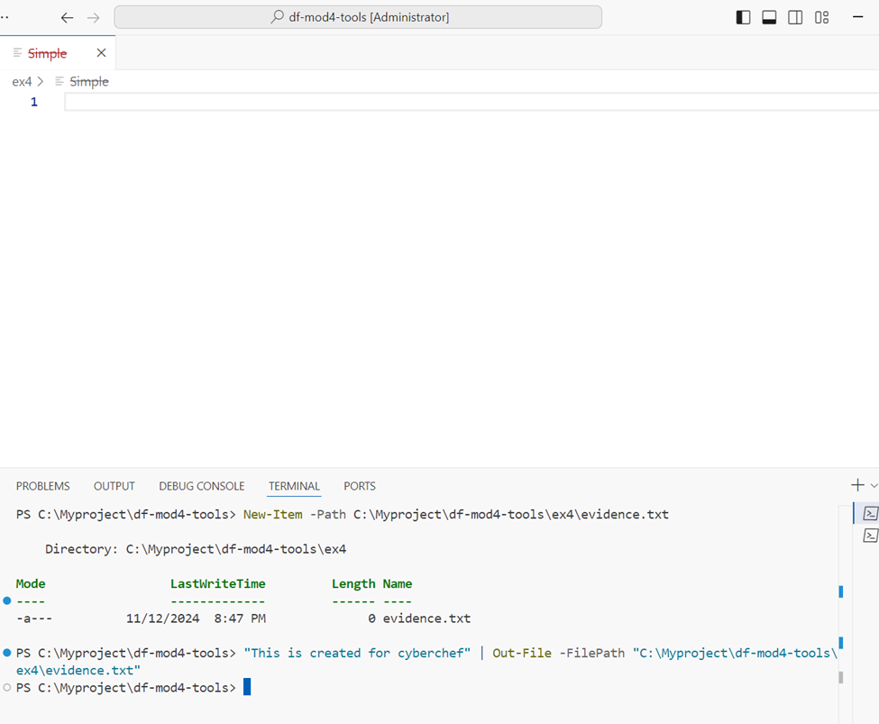

# df-mod4-tools
Add the line
## Exercise 1: Autopsy - Import Hash Database (of Known Files)

Using hash databases in Autopsy helps investigators quickly identify files without having to go through each one individually. By matching files on a system against a database of known suspicious or harmful files, investigators can speed up the analysis process, which saves time and effort. It also improves accuracy by allowing the system to flag files that might otherwise be missed, providing an easy way to double-check and confirm data integrity. This makes hash databases a really useful tool for digital forensic investigations.

To verify the success of the import, I took a screenshot showing the new hash set in Autopsy's hash database, confirming that the hash set was now accessible.

## Exercise 2: Autopsy - create Hash Database (of Evidence Files)

In this exercise, I used Autopsy to import a new "notable" hash database to identify potentially incriminating files. By leveraging hash databases, Autopsy allows investigators to cross-reference files on a system against a list of known files, which significantly speeds up the investigative process. This is especially useful when searching through large volumes of data, as it helps pinpoint evidence files without the need for manual examination.

The interface of Autopsy has evolved to streamline these processes. For example, while the "Process Unallocated Space" checkbox is no longer available, I was able to achieve the same outcome by selecting the "Run ingest modules on:" drop-down and choosing the "All Files, Directories, and Unallocated Space" option. Adjustments like these in the interface highlight the tool’s adaptability to changing needs in digital forensics, helping investigators more efficiently locate and process evidence.

Working with Autopsy and exploring these tools deepens my understanding of how technology can assist in real investigations. It also raises questions about how intuitive and user-friendly these interfaces can become as they continue to evolve.

To verify the successful import, I included a screenshot showing Autopsy on my machine with the newly loaded notable hash database. This ensures the hash set is accessible and applied in the analysis, which helps validate data and ensures accuracy in identifying suspicious files.

## Exercise 3: Hex Editor - Match File Remnants

In this exercise, I used a Hex Editor to explore how files are stored and "deleted" in an operating system. When we delete a file, we don't actually erase the file’s data. Instead, the system removes the link to that file, meaning the actual data remains in storage until it’s overwritten by something else. This is why deleted files can often be recovered, as long as their storage location hasn’t been reused.

To see this in action, I loaded a file in my Hex Editor and calculated the hash value for the first sector (the first 512 bytes). This allows us to look at file remnants and check the integrity of individual parts of a file, which is useful in digital forensics. By comparing these hash values, investigators can confirm if file remnants match parts of known files or if they have been altered.

Below is a screenshot showing the hash calculation of the first sector in my Hex Editor.

Open "Jefferson Quotes.doc" from the book's Ch09 files and use your hex editor to calculate the hash value for just the first sector. 

## Exercise 4: Simple Encryption

Bit shifting is a technique where we move binary data to the left or right. In digital forensics, bit manipulation like bit shifting can be a valuable tool for analyzing data fragments or recovering hidden information. When we shift bits, we can sometimes reveal hidden patterns or structures in the data, which can help identify remnants of deleted or partially overwritten files.

However, bit-shifting to the right can cause data loss, as the bits that “fall off” aren’t recovered. This is why we usually shift bits to the left first and then back to the right to maintain data integrity. 

In this exercise, I used Cyberchef to apply bit shifting on sample data. Below is a screenshot showing the tool in action, illustrating one of the steps I followed.

By manipulating bits, investigators can dig deeper into the raw data and recover information that may have been partially obscured or masked, making bit manipulation a useful skill in digital forensics. This technique can aid in analyzing file remnants, where every bit of data counts.

## Optional Bonus: Crack a Passcode with a Rainbow Table

A rainbow table is a pre-computed set of hash values for various potential passcodes, designed to make password cracking faster by allowing us to look up hash values rather than calculate each one individually. Rainbow tables are often large files, as each additional digit exponentially increases the number of hashes to compute.

### Objective

For this exercise, I was provided with the SHA-256 hash of a 6-digit numeric passcode. My task was to:
1. Create a rainbow table of all possible 6-digit numeric passcodes.
2. Use the rainbow table to look up the given SHA-256 hash and determine the original passcode.

### Generating the Rainbow Table

I chose to generate my rainbow table using PowerShell, writing a script that computed the SHA-256 hashes for every possible 7-digit passcode (from `0000000` to `9999999`). The script calculated each passcode’s hash and saved it to a file, creating a list of `passcode : hash` pairs. 

Using a rainbow table saves time in digital forensics and cybersecurity. Instead of recalculating hashes for each password attempt, I can quickly look up hashes in the table. This speeds up the password recovery process, especially when handling large sets of potential passwords.

Updating
